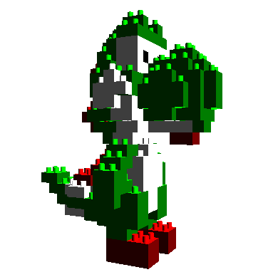

# Yoshi-OpenGL
This project is the Yoshi built in 3D from building blocks (Lego), using the Java language and the OpenGL library.

Were created six classes including main class. The class "Cores" has methods to generate the colors used in the project: red, green, white, black. In each method, were defined values to establish the material, the interaction with the light source and the color. The class "Peças" has methods to geometric modeling of each piece. The class "GLRenderer" implements the methods of the GLEventListener. These methods execute routines for OpenGL modeling, such as lighting, rotation, and translation. The class "Tela" is responsible for presenting the modeling to the user, displaying the character. Above all, this class is responsible for user interaction, in which it is possible to rotate Yoshi. In the class "Yoshi", the character is built piece by piece, as built by Lego blocks in the real world.
